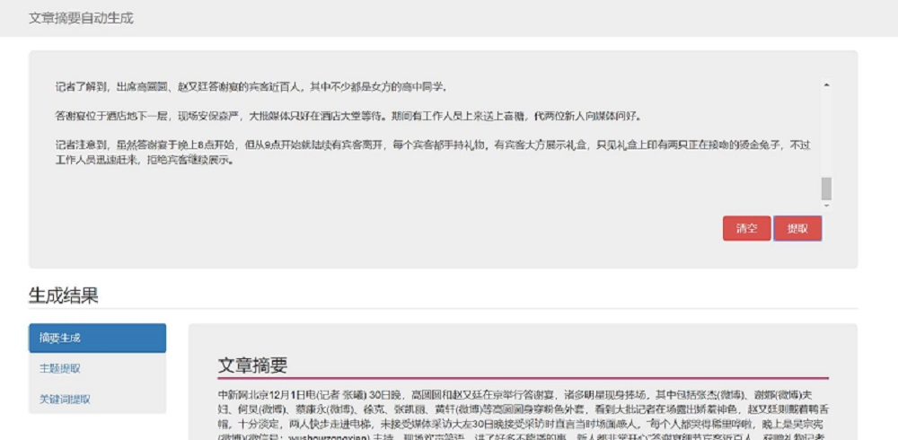

# Text-Auto-Summarization 文本自动摘要


## 项目展示

http://111.229.74.215:8188/TextSummarization/




## 项目部署

### 正常步骤
1. 将项目代码克隆到本地，git clone https://github.com/Valuebai/Text-Auto-Summarization.git
2. 安装python环境，本项目使用python3.6.5
3. 安装pip包，pip install -r requirements.txt
4. 运行项目看效果，python run.py 
5. 项目运行正常，linux上可使用下面的命令让其在后台运行
 ```
 # linux 上需要先安装gunicorn -->> pip3 install gunicorn
 sh run.sh 或者 . run.sh 运行
 ```
开启服务器对应8188端口
firewall-cmd --zone=public --add-port=80/tcp --permanent 永久开启80端口
firewall-cmd --reload #重启firewall 每次新添加端口都要
> 参考：[【Linux】CentOS-常用命令&新购买云服务器安装必看](https://github.com/Valuebai/awesome-python-io/issues/1)

 
### 为Python项目创建独立的虚拟环境（可选）
[python在win/linux创建虚拟环境](https://blog.csdn.net/luhuibo318/article/details/94011917)


### 新购买的linux-CentOS7 云服务器部署指南
1. [【Linux】CentOS-常用命令&新购买云服务器安装必看](https://github.com/Valuebai/awesome-python-io/issues/1)
2. [总结python+flask项目在linux部署的五大方法](https://blog.csdn.net/luhuibo318/article/details/102688154)


【核心技术】待整理进来 https://github.com/ZhiWenMo/Autosummarization_self_dis/blob/master/Autosummarization.ipynb

## 目前的摘要技术分为
1. Extraction 抽取式
2. Abstraction 生成式
```markdown
> 目前Extraction抽取式的主要方法：

>> - 基于统计：统计词频，位置等信息，计算句子权值，再简选取权值高的句子作为文摘，特点：简单易用，但对词句的使用大多仅停留在表面信息。

>> - 基于图模型：构建拓扑结构图，对词句进行排序。例如，TextRank/LexRank。

>> - 基于潜在语义：使用主题模型，挖掘词句隐藏信息。例如，采用LDA，HMM。

>> - 基于线路规划：将摘要问题转为线路规划，求全局最优解。

>> 在python语言中用于文本摘要自动提取的库包括goose，SnowNLP，TextTeaser，sumy，TextRank等。
```

## 项目使用指南

### 1. git clone https://github.com/Valuebai/Text-Auto-Summarization.git
### 2. 入文件夹目录，使用下面的##Ptyhon创建虚拟环境 + ## Requirements 进行安装
### 3. 服务器部署使用下面的## linux部署指南


## 项目效果
http://39.100.3.165:8188/TextSummarization/

# projects

## Textrank 和 Pagerank

[ipynb的地址]()

## 核心算法详解（采用Extraction）

Extraction自动摘要系统可以大致分为一下独立的三步:

1. 构建一个包含文本主要信息的表征(表现形式)。
2. 基于构建的表现形式对句子评分。
3. 根据评分选出构成摘要的句子。

```md
**表征方法介绍**
概览：常用的文本表征方式基本可分为两种:
- topic representation
- indicator representation。

topic representation就是把文本转化为诠释文本涉及的话题的表征形式，其中topic representation中有比较基本的词频驱动方法、LSA和LDA等等，表征完成后用统计的方法确定阈值来筛选重要的句子。
indicator representation就是把文本转化成某些特征，例如标题、关键字、句子长度、是否含有某些词汇和句子的位置、KNN等等。然后直接评分排序抽取出重要的句子。
```

### TextRank用于关键词提取的算法如下：


1. 第一步是把所有文章整合成文本数据

2. 接下来把文本分割成单个句子

3. 然后，我们将为每个句子找到向量表示（词向量）。

4. 计算句子向量间的相似性并存放在矩阵中

5. 然后将相似矩阵转换为以句子为节点、相似性得分为边的图结构，用于句子TextRank计算。

6. 最后，一定数量的排名最高的句子构成最后的摘要。


### 使用TextRank4zh来实现textrank获取关键句子，并进行排序

1. 在这里，我们获得了TextRank4zh返回的前5个关键句以及权重


### Keywords 关键字

> 关键字是很重要的，如果我们能够比较准确的提取出来关键词/字，然后对关键字/词包含的句子增加其权重；

对整篇文章提取关键字，该关键字可以通过TextRank或者tfidf或者gensim自带的包进行提取。 然后对包含了关键词的句子进行手动加权


### Title 标题

> 如果一个文章有标题，那么，其实这个标题已经包含了很多它的摘要信息， 在考虑语义建模的时候，就应该对标题更加重要的考虑；

如果该文本有标题，那么标题可以帮助我们很多。
在之前，我们计算每个句子与文章整体的相似度是对每个子句与整体文章进行相似度距离计算，
那么，我们这个时候，就可以把标题的embedding结果拿出来，那么每句话的相似度就是这句话与整体文章的相似度和标题的相似度的一个“结合”。


### Position 位置信息

对于句子而言，如果其出现在段落开端，结尾，是否是重要的？ 请做实验证明之，并且代码进行改进。 

> 对于一些文本，文章，例如一个故事的这种文章，那么他的textRank， sentence embedding 会发现，并不会出现很明显有些句子是重要的，有些句子不重要的，如果plot他的曲线的话，我们这个时候就要考虑他的位置，开头，结尾，增加一些权重；


### KNN思想进行“平滑”操作

**结合KNN算法的思路，使生成的文本摘要更流畅，更具可读性。根据句子的评分，画出句子评分的分布:** </br>


**我们会发现，句子的评分分布是这样起伏很大的尖锐曲线，这样抽取的句子会断断续续，显得很突兀，因此我们需要根据句子自身的重要性和周围句子的重要性，结合KNN算法使得结果更加平滑。**

> 对于一个sub_sentence来说，它的重要性，取决于他本身的重要性和周围的句子(neighbors)的重要性的综合；

例如，当我们有一个列表是 [1, 1, 2, 3, 8, 1, 2]的时候，其中的 8 数值太大，这在我们的摘要中的表现为，
该句子周围的句子都是不那么相关的，但是该句子单独的相关性很高。 那么，如果把这个句子摘录进来，就会导致“不通顺”.
 
我们可以采用KNN的思想，将这个列表进行重新计算，让它每一个元素的值，等于自己的值和周围的几个值的一个计算结果。 


### Topic 主题信息-使用Gensim+LDA使用

自学Gensim LDA的使用方法，对于文章获得其主题，然后依据主题对每个句子进行判断，每个句子是否和该主题相关。 
参考网站： 
1. Google Search： Gensim LDA
2. https://github.com/xiaoyichao/-python-gensim-LDA-/blob/master/topicmodel3.py


### Task 合并以上功能，实现一个单独的函数，该函数接受一个长文本和字数限制，输出一个短文中

```python

# 首先将**三个权重**指数按照一定的系数相加，对所有句子按照权重值进行降序排序：
# feature_weight = [1,1,1] ，是可调整的权重指数参数，控制关键字，句子位置，句子相似度信息的比重

import collections
def ranking_base_on_weigth(sentence_with_words_weight,
                            sentence_with_position_weight,
                            sentence_score, feature_weight = [1,1,1]):
    sentence_weight = collections.defaultdict(lambda :0.)
    for sent in sentence_score.keys():
        sentence_weight[sent] = feature_weight[0]*sentence_with_words_weight[sent] +\
                                feature_weight[1]*sentence_with_position_weight[sent] +\
                                feature_weight[2]*sentence_score[sent]

    sort_sent_weight = sorted(sentence_weight.items(),key=lambda d: d[1], reverse=True)
    return sort_sent_weight

```


文本自动摘要，如何将标题、位置等特征添加到最终的排序中？
高老师的提取结果中，第一句和最后一句跟原文的不一样，看来是有经过特殊处理的，是怎么处理的呢


---
## 本地&线上同步推进（后续优化）
### 业务场景
本地与线上的 Swagger API 文档的接口的地址是不同的，但都依赖同一个配置文件 **`app\config\setting.py`**。<br>
而个人项目有着本地和线上同步，开发和测试同步的需求，会不断修改 **`app\config\setting.py`** 文件，无法用 **`.gitignore`** 做到忽略配置文件，本地和线上配置隔离的效果。 

### 解决
**`本地`** 和 **`线上`** 自动根据所处的环境(由 .gitignore 控制)不同，选择不同的配置文件。<br>
那么， **`本地`** 可以比 **`线上`** 多了 **`app/config/dev.py`** 文件; 基于该文件的存在与否，可以用 **`if else`** 控制 **`app/config/`** 中配置输出。

### Demo
1. `echo "/app/config/dev.py" >> .gitignore` # 追加 Git 忽略提交配置到 .gitignore
2. 新建 **`app/config/dev.py`** 文件


## Flask Blueprint，分隔视图
**当你的Flask项目膨胀到一定规模的时候， 全部都写到主入口之中。 一定需要按照模块进行拆分。 Blueprint(蓝图)就是这个时候需要使用的东西。**

- [Blueprint 之中使用日志](https://www.flyml.net/2018/12/12/flask-logging-usage-demo/)
- 完成blueprint框架后，在APP中的blueprint中
```python
from flask import current_app
# 在需要的地方
current_app.logger.info("simple page info...")
```

## 性能问题——加载jieba分词的model需要1s左右

性能指标：在初次打开阶段时间较长，后续逐渐变好，所以这是为啥呢？
——已经定位原因，首次加载jieba分词时loading了1.309s导致的
```md
Building prefix dict from the default dictionary ...
Dumping model to file cache C:\Users\AppData\Local\Temp\jieba.cache
Loading model cost 1.309 seconds.
Prefix dict has been built succesfully.
```

解决：
- 如果不希望每次都加载词库，可以让jieba初始化后再后台一直运行：
- 比如在flask中使用的时候应该在初始化app文件中初始化jieba，然后其他程序再调用初始化后的，这个之后讲flask的时候会讲到
```md
jieba 采用延迟加载，import jieba和 jieba.Tokenizer()不会立即触发词典的加载，
一旦有必要才开始加载词典构建前缀字典。如果你想手工初始 jieba，也可以手动初始化。

#!/usr/bin/python
# -*- coding: UTF-8 -*-

import jieba
jieba.initialize()

```


# 前端页面

## Flask 快速完成前端页面


### 无法加载js, css等路径加载问题（在pycharm里面../ 没有报错，实际部署后404）

解决：将../ 改为 ./ ，因为是在text_blueprint.py文件启动的，python是动态加载，默认了此时的路径是text_blueprint.py的，用../会找不到对应的static
      
引申：在pycharm用../ 这种返回上一级的方法去单独执行一个文件，在pycharm里面是正常的，但是在windows命令行或者linux的部署中，是从run.py启动的，往往会出现这种情况


## D3.js (Data-Driven Documents) 数据可视化

[D3 的全称是（Data-Driven Documents），顾名思义可以知道是一个被数据驱动的文档。听名字有点抽象，说简单一点，其实就是一个 JavaScript 的函数库，使用它主要是用来做数据可视化的](http://wiki.jikexueyuan.com/project/d3wiki/introduction.html)


## 参考的页面
- https://github.com/MustAndy/AI_for_NLP/tree/master/Assi5/Project1_NLP_Become_human/code
一开始参考里面的js, html布局，前后端的交互


- https://github.com/zhangxu999/opinon_extraction 
- http://39.100.3.165:8421/index.html
Amazing4 zhangxu1573@qq.com
主页的模板套得很好看，学习里面的jquery


- https://github.com/4keyboardman/StandpointExtract 
- http://39.100.3.165:8871/
左右的布局很好看，还有的loading加载的学习


- http://39.100.3.165:8567/  

主页UI不好看，但是具体提取页面和生成树形图，学习了

有言论提取，文章摘要，情感分析

